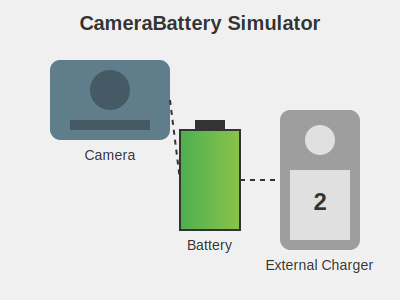

# CameraBattery Simulator



## Description

CameraBattery Simulator is a Java application that models a removable and rechargeable camera battery. This project demonstrates object-oriented programming concepts, simulating real-world battery behavior including charging, discharging, and power management.

## Features

- Simulate battery charging through camera USB and external charger
- Model battery discharge when powering the camera
- Track battery capacity and current charge
- Simulate external charger with multiple power settings
- Monitor total power drain over time
- Manage battery connections (camera, external charger, or disconnected)

## Key Concepts

- Battery capacity and charge management
- Power consumption simulation
- Charge rate calculations
- External charger with multiple settings
- Battery location tracking (camera, external charger, or disconnected)

## Usage

To use the CameraBattery class in your project:

1. Import the class:
   ```java
   import hw1.CameraBattery;
   ```

2. Create a new CameraBattery object:
   ```java
   CameraBattery battery = new CameraBattery(1000, 2000);
   ```

3. Interact with the battery:
   ```java
   battery.moveBatteryCamera();
   double drained = battery.drain(100.0);
   double charged = battery.cameraCharge(50.0);
   ```

## Example

```java
CameraBattery battery = new CameraBattery(1000, 2000);
System.out.println("Initial battery charge: " + battery.getBatteryCharge());

battery.moveBatteryCamera();
double drained = battery.drain(100.0);
System.out.println("Drained: " + drained);

battery.moveBatteryExternal();
battery.buttonPress(); // Increase charger setting
double charged = battery.externalCharge(60.0);
System.out.println("Charged: " + charged);

System.out.println("Final battery charge: " + battery.getBatteryCharge());
```

## API Highlights

- `CameraBattery(double batteryStartingCharge, double batteryCapacity)`: Constructor
- `buttonPress()`: Increment external charger setting
- `cameraCharge(double minutes)`: Charge battery through camera USB
- `drain(double minutes)`: Drain battery when powering camera
- `externalCharge(double minutes)`: Charge battery using external charger
- `moveBatteryCamera()`: Connect battery to camera
- `moveBatteryExternal()`: Connect battery to external charger
- `removeBattery()`: Disconnect battery from all devices

## Future Improvements

- Graphical user interface for visual battery management
- Multiple battery support for camera systems
- Battery health degradation over time
- Temperature effects on battery performance
- Integration with actual camera firmware for real-world testing

## Author

Abhay Prasanna Rao
